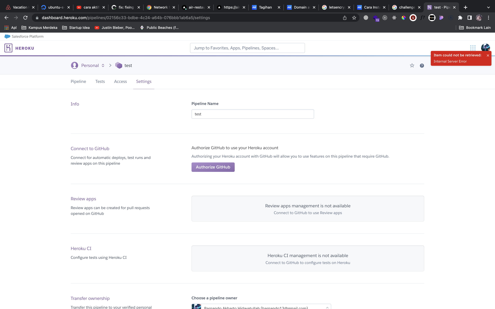

# Hello There 👋
Im Barnando, and im a fullstack developer
### REGARDS
at first im apologize about my deadline, im very busy with my current job that i've been doing, and i do mentoring for **Kampus Merdeka** 2 hour every single day at 9PM GMT+7 including on saturday and i only be free only on the weekend (Sunday).

and i got some problem with the heroku (Binding my repo), so i just bought a simple domain including server using digital ocean



**API DOCUMENTATION LINK**

```bash
https://www.getpostman.com/collections/62acf62fae58b3859e76
```
**API WORKSPACE**
```bash
https://app.getpostman.com/join-team?invite_code=59cd17d5d0971441c8461a657f82d397&target_code=96d47a00a6530a3d8c2bbabc1cec6f52
```

**BACKEND URI**
```bash
https://api.airrest.xyz
```
